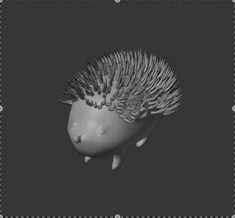

# wigglythings

running:
python -m venv venv
source venv/bin/activate
pip install -r requirements.txt

todo:
- dynamically update normals 
- get rid of hashmap for base mesh vertices
  
updates:

- moved stuff to warp
- make face selector for obj files for displaying instances
- finite differences for velocity then acceleration
- adjusted parameters for dyrt until it worked
- eigenvalues smaller than 0, just removed them and changed eigenvalue solver to look around 3 instead of 0
  

to cite:
- dyrt
- simkit
- tetwild
- https://arxiv.org/abs/2403.06321
- https://viterbi-web.usc.edu/~jbarbic/cuda-uUq/WangBarbic-CUDA-MIG-2020.pdf
- https://arxiv.org/pdf/2408.10099
- https://github.com/dilevin/usdmultimeshwriter
- https://github.com/tytrusty/pba-assignment-cd
- https://github.com/dilevin/CSC417-physics-based-animation/blob/master/lectures 07-fast-solvers.pdf
- https://github.com/dilevin/CSC417-physics-based-animation?tab=readme-ov-file

notes:

tetwild terminal command:
./FloatTetwild_bin --input /Users/yixinlok/Desktop/empty2/loosecoil.obj --coarsen --manifold-surface

- when tetwilding, make sure the obj file is triangulated
  