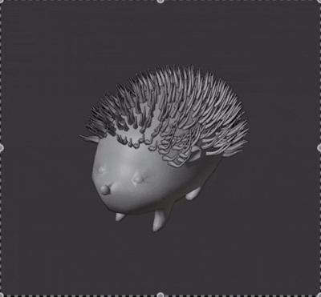

# wigglythings

running:
bash run.sh

todo:
- get rid of hashmap for base mesh vertices
- move numpy reshaping snippets to warp

updates:

- moved stuff to warp
- make face selector for obj files for displaying instances
- finite differences for velocity then acceleration
- adjusted parameters for dyrt until it worked
- eigenvalues smaller than 0, just removed them and changed eigenvalue solver to look around 3 instead of 0
  

to cite:
- dyrt
- simkit
- tetwild
- https://arxiv.org/abs/2403.06321
- https://viterbi-web.usc.edu/~jbarbic/cuda-uUq/WangBarbic-CUDA-MIG-2020.pdf
- https://arxiv.org/pdf/2408.10099
- https://github.com/dilevin/usdmultimeshwriter
- https://github.com/tytrusty/pba-assignment-cd
- https://github.com/dilevin/CSC417-physics-based-animation/blob/master/lectures 07-fast-solvers.pdf
- https://github.com/dilevin/CSC417-physics-based-animation?tab=readme-ov-file

notes:

tetwild terminal command:
./FloatTetwild_bin --input /Users/yixinlok/Desktop/empty2/loosecoil.obj --coarsen --manifold-surface

slurm commands:
srun --gres=gpu:1 -c 2 --mem=4G -t 60 --pty bash --login
sbatch run.sh

- when tetwilding, make sure the obj file from blender is triangulated
  

  theres a problem

  "Warning: Failed to configure kernel dynamic shared memory for this device, tried to configure wp_update_all_instances__locals__wp_get_modal_displacement_f8ec3375_cuda_kernel_backward kernel for 134240 bytes, but maximum available is 101376"

this is dependent on the number of vertices in the instance * number of modes

parameters for each mesh

pangolin
alpha: 12
beta: 0.03
instance scale: 0.07
instances per face: 1

hedgehog
alpha: 0.4
beta: 0.06
instance scale: 0.1
instances per face: 10

alpaca
alpha:
beta: yet to figure out but xi is perfect around 0.7-0.8 range
instance scale: 0.07
instances per face: 10

scp yixinlok@zeus.dgp.toronto.edu:~/wigglythings/out/pangolin_240_20260323-005458.usda ./Desktop

19023 - 10 frames only, checking whats wrong with hedgehog
19036 - pangolin 240 frames

19101 - 
19102 - pangolin 240 frames

incorrect pangolin - 005125 usda
19144 - hedgehog
19145 - correct pangolin